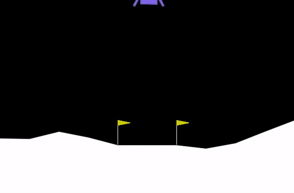
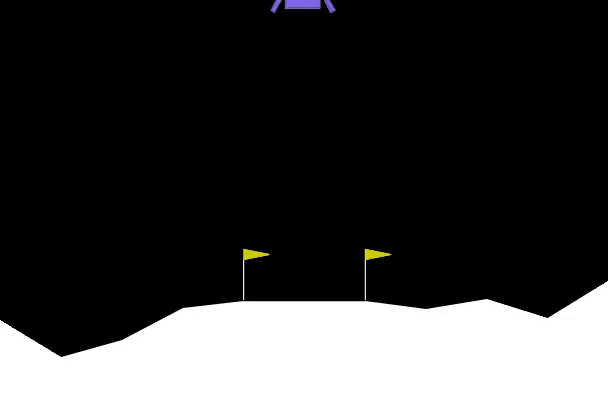
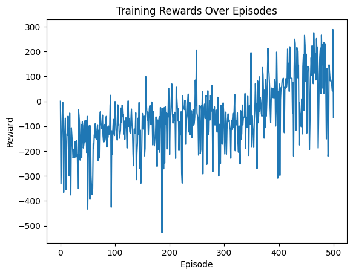

# Lunar Lander GYM dengan PyTorch

Proyek ini merupakan implementasi dari simulasi Lunar Lander menggunakan library OpenAI Gym dan framework PyTorch. Proyek ini berfokus pada pengembangan agen kecerdasan buatan yang dapat mendaratkan roket dengan aman di permukaan bulan menggunakan teknik reinforcement learning.

## Demo Video

Berikut adalah demo singkat dari simulasi:

### Demo tanpa LSTM (Pytorch)



### Demo dengan LSTM (Tensorflow)



di pembaharuan ini saya menambah kan model dengan LSTM sehinga model dapat belajar dari urutan kejadian sebelum nya untuk yang LSTM ini menggunakan Tensorflow
history:


## Fitur

- **Simulasi OpenAI Gym** untuk Lunar Lander.
- **Model berbasis PyTorch** untuk pembelajaran reinforcement.
- **Agen cerdas** yang belajar dari pengalaman untuk mendaratkan roket dengan aman.

## Instalasi

Untuk menjalankan proyek ini, ikuti langkah-langkah berikut:

1. Clone repositori ini:
   ```bash
   git clone https://github.com/username/LunarLanderGymPyTorch.git
   ```
